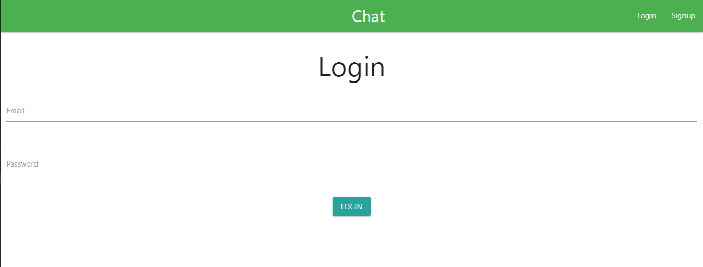

# MERN Stack - Chat App
> Chat App built with NodeJS, React, socket io and MongoDB, authentication with JWT

## Author: Kavindu Madushanka

## Install dependencies for server 
### `npm install`

## Install dependencies for client
### cd client ---> `npm install`

## Connect to your mongodb and add info in index.js ---> const mongoDB

## Run the client 
### cd client ---> `npm start`

## Run the server
### cd server ---> `nodemon index`

### Server runs on http://localhost:5000 and client on http://localhost:3000

### User interface 

